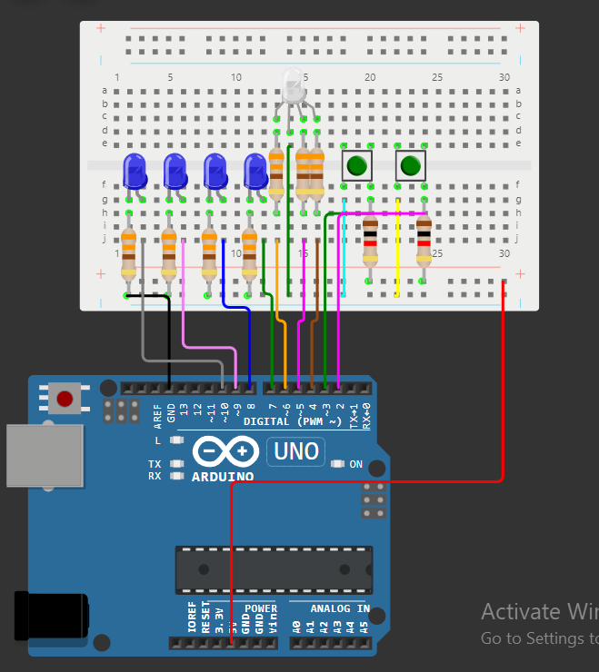
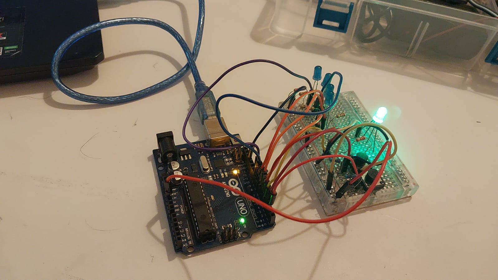

# Tema 1 - Sistem de încărcare a unui vehicul electric

## Descrierea Task-ului
Această temă presupune simularea unei stații de încărcare pentru un vehicul electric folosind LED-uri și butoane pentru a reprezenta procentajul de încărcare și disponibilitatea stației. Sistemul trebuie să gestioneze stările butoanelor prin debouncing și să coordoneze toate componentele în mod corect.

### Cerințe:
1. **Led-ul RGB** reprezintă disponibilitatea stației:
   - Verde = stație liberă.
   - Roșu = stație ocupată.
2. **Led-urile simple** reprezintă procentajul de încărcare a bateriei:
   - L1 = 25%, L2 = 50%, L3 = 75%, L4 = 100%.
   - LED-ul care semnifică procentul curent va clipi, iar cele din urmă lui vor rămâne aprinse constant.
3. **Butonul de start** pornește procesul de încărcare.
4. **Butonul de stop** oprește forțat procesul de încărcare și resetează stația la starea liberă.

Pentru implementare, trebuie să folosiți debouncing la butoane și să respectați flow-ul descris în cerințe.

## Componente Utilizate
- 4x LED-uri simple (pentru a simula încărcarea în procente)
- 1x LED RGB (pentru a indica disponibilitatea stației)
- 2x Butoane (pentru pornire/oprire încărcare)
- 7x Rezistoare de 220/330 Ohm
- 2x Rezistoare de 1K Ohm
- Breadboard
- Cabluri de conexiune

## Schema Electrică
### Simulare:

## Setup Fizic

## Demo Video

[Click aici pentru video](https://youtube.com/shorts/AjTbagy9bjc?feature=share)

## Documentație Tehnică

### 1. Starea inițială
- LED-ul RGB este verde, ceea ce înseamnă că stația este liberă și nu se efectuează nicio încărcare.
  
### 2. Începerea încărcării
- La apăsarea butonului de **start**, LED-ul RGB devine roșu pentru a indica ocuparea stației.
- Procesul de încărcare începe prin aprinderea primului LED (L1), care va clipi timp de 3 secunde pentru a semnala atingerea primului nivel de încărcare (25%).

### 3. Progresia încărcării
- După 3 secunde, L1 rămâne aprins, iar L2 începe să clipească, indicând atingerea a 50% din încărcare.
- Acest proces continuă pentru L3 (75%) și L4 (100%).

### 4. Finalizarea încărcării
- La finalizarea încărcării, toate LED-urile vor clipi simultan de 3 ori.
- După aceasta, stația se resetează și LED-ul RGB devine verde din nou, semnalizând că stația este liberă pentru o nouă sesiune de încărcare.

### 5. Oprirea forțată
- Apăsarea lungă a butonului de **stop** oprește imediat încărcarea și resetează sistemul la starea inițială.
- Toate LED-urile clipesc de 3 ori înainte de resetare, iar LED-ul RGB devine verde.

## Concluzie
Acest sistem simulează funcționalitatea unei stații de încărcare reale pentru vehicule electrice, coordonând LED-urile pentru a semnala progresul încărcării și gestionând stările butoanelor cu debouncing pentru o funcționare fiabilă.

