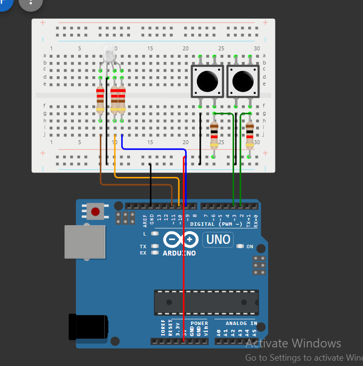
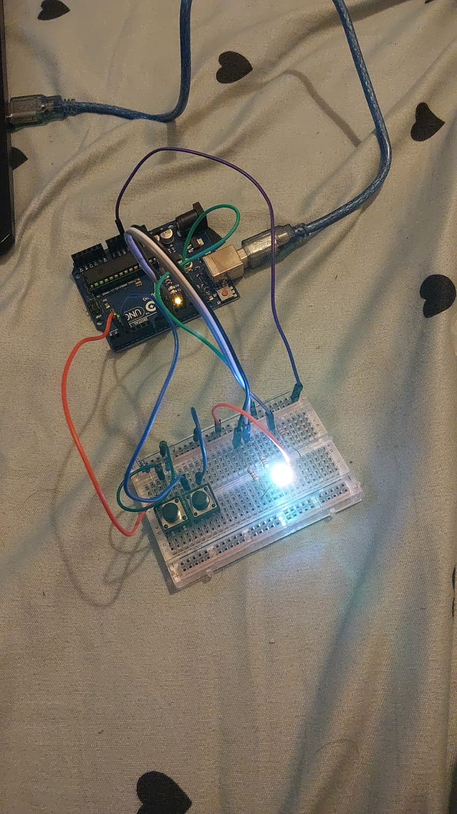

# Tema 2 - TypeRacer Game

## Descrierea Task-ului
Această temă constă în crearea unui joc simplu de tip **TypeRacer** folosind un Arduino. În acest joc, utilizatorul trebuie să tasteze corect cuvintele afișate într-un anumit interval de timp, în funcție de dificultate. Programul include o serie de caracteristici pentru a gestiona dificultatea, verificarea răspunsurilor și feedback vizual prin intermediul unui LED RGB.

### Cerințe:
1. **LED-ul RGB** indică starea jocului:
   - **Alb**: stare de repaus.
   - **Verde**: cuvântul introdus este corect.
   - **Roșu**: cuvântul introdus este greșit.
2. **Butonul Start/Stop**:
   - Dacă jocul este oprit, apăsarea butonului inițiază o nouă rundă după o numărătoare inversă de 3 secunde.
   - Dacă jocul este activ, apăsarea butonului oprește imediat runda.
3. **Butonul de dificultate**:
   - Controlează viteza cu care apar cuvintele și este activ doar în starea de repaus.
   - La fiecare apăsare, dificultatea se schimbă între: **Usor**, **Mediu** și **Greu**, afișând un mesaj prin serial („Easy/Medium/Hard mode on!”).
4. **Generarea cuvintelor**:
   - Un dicționar de cuvinte este folosit pentru a genera cuvinte aleatorii care trebuie tastate corect.
   - Dacă cuvântul este tastat corect, un nou cuvânt apare imediat. În caz contrar, un nou cuvânt apare după timpul stabilit de dificultate.
5. **Timpul jocului**:
   - Runda durează 30 de secunde.
   - La finalul rundei, în terminal se afișează numărul total de cuvinte tastate corect.

## Flow-ul Jocului
1. Jocul începe în stare de **repaus** (LED alb).
2. **Selectați dificultatea** folosind butonul de dificultate. În terminal va apărea mesajul cu modul selectat.
3. Apăsați **butonul de start** pentru a începe runda.
   - LED-ul RGB clipește timp de 3 secunde, indicând numărătoarea inversă (3, 2, 1).
4. Jocul începe:
   - LED-ul RGB devine **verde** dacă textul introdus este corect și **roșu** în caz de greșeală.
   - La fiecare tastare corectă, un nou cuvânt este afișat imediat. Dacă nu este tastat corect în timpul stabilit, un nou cuvânt apare.
5. Runda se încheie automat după 30 de secunde, iar scorul este afișat în terminal.
6. Jocul se poate opri oricând apăsând butonul de start.

## Componente Utilizate
- **Arduino UNO** (ATmega328P microcontroller)
- **1x LED RGB** (pentru a semnaliza starea jocului)
- **2x Butoane** (pentru start/stop rundă și selectarea dificultății)
- **5x Rezistoare** (3x 220/330 ohm, 2x 1000 ohm)
- **Breadboard**
- **Cabluri de conexiune**

## Schema Electrică
### Simulare:

## Setup Fizic

## Demo Video

[Click aici pentru video](https://youtu.be/WflGjgBa5gk)

## Documentație Tehnică

### 1. Starea inițială
- LED-ul RGB este alb, indicând că jocul este în repaus și gata de o nouă rundă.

### 2. Începerea jocului
- La apăsarea butonului de **start**, LED-ul RGB clipește alb timp de 3 secunde, semnalizând numărătoarea inversă pentru începutul rundei.

### 3. Derularea jocului
- La fiecare cuvânt afișat, LED-ul RGB indică starea:
   - **Verde** pentru răspuns corect.
   - **Roșu** pentru răspuns greșit.
- Dificultatea setată controlează timpul de răspuns. Dacă cuvântul nu este introdus în timpul stabilit, se trece la următorul cuvânt.

### 4. Încheierea jocului
- Jocul se încheie automat după 30 de secunde sau poate fi oprit manual cu butonul **start**.
- Scorul total (numărul de cuvinte corecte) este afișat în terminal, iar LED-ul RGB revine la alb, indicând starea de repaus.

## Concluzie
Acest joc TypeRacer pe Arduino oferă o experiență interactivă prin verificarea cuvintelor tastate corect și schimbarea dificultății, folosind LED-ul RGB și butoanele pentru controlul jocului și feedback vizual.
